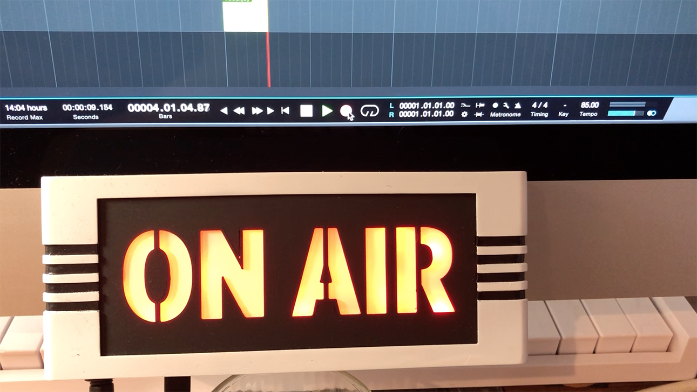
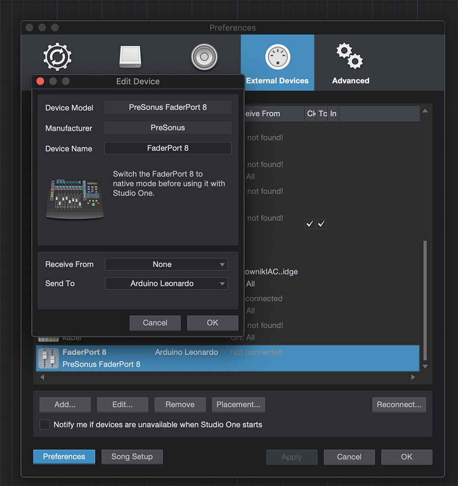

# Presonus Studio One "On Air" sign

I have small home studio where I record with my friends. It often happens that someone from the house will enter when we record, ruining the take.
So I was in need to install "on air" singal above the door.
There is no such device on the marked that would work with Presonus Studio One, so I made it myself.
 
## Youtube clip

## How it works.

It's based on small arduino leonadro that powers red led strip.

The code for it is very simple, you can find it in [on_air.ino](on_air.ino), upload it via arduino software.
 
Basically arduino report in the system as midi device and listen for midi signals.
 
To make it work you need to go to Studio One Preferences -> External Devices and add "FaderPort 8" and set "Send To" to your arduino.
 
Presonus is sending midi note when recording starts or stops.

The case I 3d printed from https://www.thingiverse.com/thing:1506862
After sanding and painting it looks really good.
 

